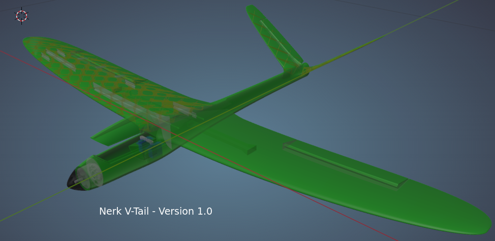

# Nerk V-Tail
## Assembly Instructions

## Introduction
The Nerk V-Tail is a 1 metre wingspan 3D printed RC model aircraft.

## Specifcations
Wingspan            1000mm  
Print Weight        210g  
All up Weight       360g 
## Suggested Purchases
The following items are what I used in Version 1 of this model. Note that I didn't buy this equipment specifically - it's what I had lying around. The point of this project is to use the Blender design file to alter the model to suit youself. Let me know if you need help to modify the design to suit different equipment and I'll help if I have time. I would like to add additional equipment to the Blend file.
## Electrics
Motor               Racestart 2205 2300kv  
ESC                 20Amp  
Battery             550mA 3S  
Servos              6g EMax (Or similar)  
## Spars
### Wing
4mm Carbon Tube         440mm  
4mm Carbon Tube x2      120mm
3mm Bamboo Skewer x6    30mm  
### Tailplane
3mm Bamboo Skewer x2    115mm  
3mm Bamboo Skewer x2    65mm  
## Hinges
CA Hinge Material  
## Pushrods
3mm Bamboo Skewer x2    200mm  
1mm Piano Wire          80mm
Shrinkwrap tubing
## Filament
Colorfabb LW-PLA        250g
PLA for Spinner         10g
PETG for motor mount    5g  
# Printer Settings

